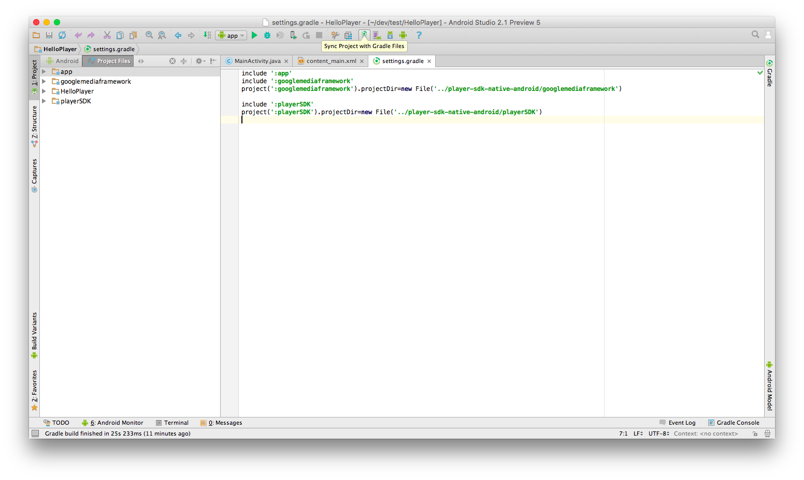
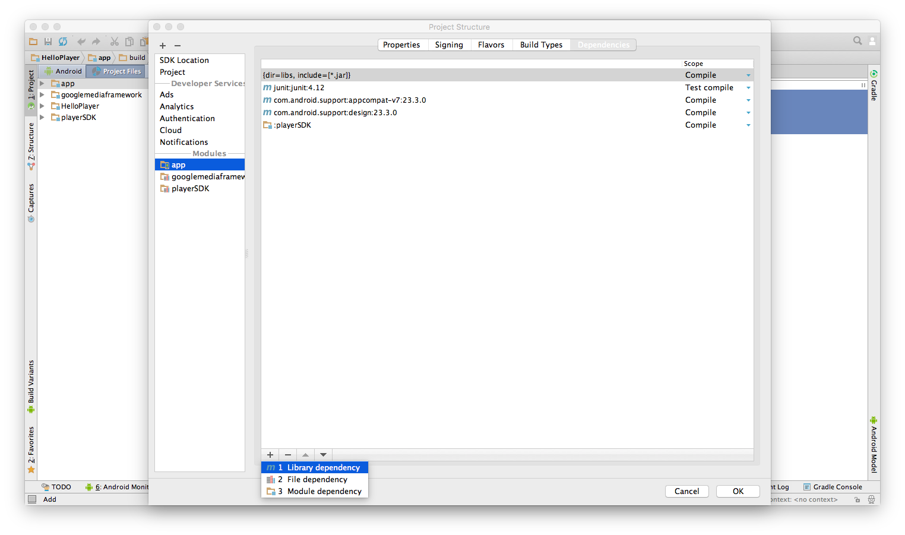

To get started using the Android Player SDK, you will first need to install the Android SDK and Android Virtual Device (AVD), and then set up the Player SDK for Android.

## Step 1: Install the Android SDK  

1. In the Android Studio menu, navigate to Tools > Android > SDK Manager.
2. Click the **SDK Platforms** tab.
3. Install at least the following required SDK levels and all levels in between: 
 * Minimum API: Android KitKat (API 19)
 * Target API: Android M (API 23)
4. Click the **SDK Tools** tab and install Android SDK Tools version 23.0.1 or later.

## Step 2: Install Android Virtual Device (AVD)  

1. In the Android Studio menu, navigate to Tools > Android > AVD Manager.
2. Click **Create Virtual Device...**.
3. Install at least one AVD that targets Android KitKat (API 19) and above. To learn how to set up an AVD in Android Studio, follow the instructions in this [article](developer.android.com/guide/developing/devices/managing-avds.html).

## Set up the Player SDK  

1. Clone the Android SDK and make sure that it resides in the **same** folder as your application:
	```
	git clone https://github.com/kaltura/player-sdk-native-android.git
	```
2. Next, edit the ```Setting.gradle``` file as follows:

    ```
    include ':googlemediaframework'
    project(':googlemediaframework').projectDir=new File('../player-sdk-native-android/googlemediaframework')

    include ':playerSDK'
    project(':playerSDK').projectDir=new File('../player-sdk-native-android/playerSDK')
    ```
    

3. Synchronize the project with the updated gradle:
    

4. Make sure that you cloned the ```player-sdk-native-android``` project to the same folder of your project; if you prefer to clone it in another location, remember to update the ```settings.gradle``` with the relevant path.

5. Right-click your application folder and select ```Open Module Settings```.
    

6. Select the ```Dependencies``` tab, click the ```+``` button and then choose the playerSDK as ```module dependency```.
    

