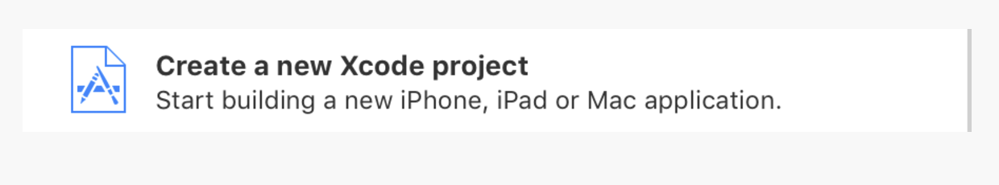
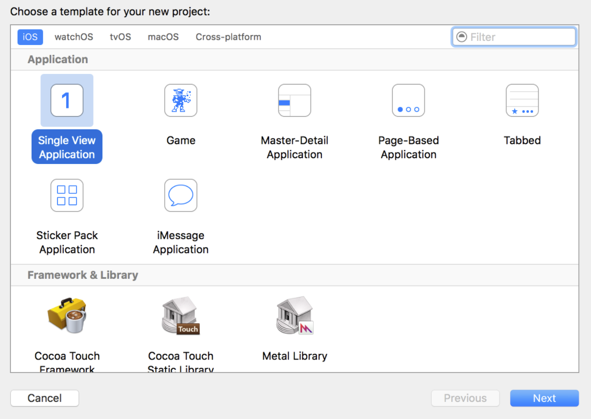
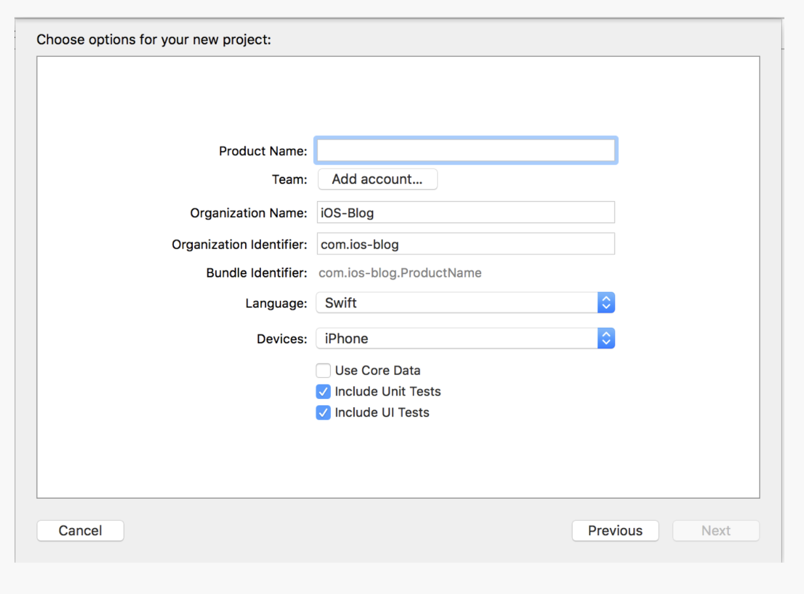

## Quick Start Using Swift  

In this section, you'll learn how to build a simple video application using the Swift programming language.

### Create the Project  

#### Set Up a Project in Xcode  

1. Open Xcode and click **start new Xcode Project**:
	 

2. Next, select **Single View Application** and click **Next**:
	 

3. In the dialog screen displayed, enter the relevant details:
	 


#### Add the SDK

The simplest way to add the SDK and its dependencies to your project is by using CocoaPods.

>Note: Using CocoaPods on an existing Xcode project will modify the project file. You may want to make a backup before doing this.

1. In your project folder, create a plain text file called `Podfile` (no file extension).
2. Using a text editor, add the following lines of code to the Podfile and save it.

	```ruby
	source 'https://github.com/CocoaPods/Specs.git'

	use_frameworks!

	platform :ios, '8.0' # (define required version)

	target 'Simple-Video-Player' do
 	 pod 'PlayKit'
	end

	# needed for swift
	pre_install do |installer|
    	def installer.verify_no_static_framework_transitive_dependencies; end
	end

	# needed for swift
	post_install do |installer| 
   	 installer.pods_project.targets.each do |target| 
        target.build_configurations.each do |config| 
            config.build_settings['ALWAYS_EMBED_SWIFT_STANDARD_LIBRARIES'] = 'NO'
            config.build_settings['OTHER_SWIFT_FLAGS'] = '-Xfrontend -warn-long-function-bodies=100'
        end 
   	 end 
	end

	```
	
3. Navigate to the podfile location via Terminal and type the command:

	```ruby
	`pod install

	````

#### Import the Native SDK  

Go to the desired file (e.g., `ViewController.swift`) and add the line below:

	```swift
	import PlayKit

	```

### Code the Video Player Application  

You're now ready to code the video player application using the following options.

**Declare a Player Variable**

	```swift
	var playerController: Player

	```

**Set a Player Instance via a Sample Configuration** 

	```swift
	let config = PlayerConfig()
        
        var source = [String : Any]()
        source["id"] = "123123" //"http://media.w3.org/2010/05/sintel/trailer.mp4"
        source["url"] = "https://devimages.apple.com.edgekey.net/streaming/examples/bipbop_16x9/bipbop_16x9_variant.m3u8"
        
        var sources = [JSON]()
        sources.append(JSON(source))
        
        var entry = [String : Any]()
        entry["id"] = "Trailer"
        entry["sources"] = sources
        
        config.set(mediaEntry: MediaEntry(json: JSON(entry)))//.set(allowPlayerEngineExpose: kAllowAVPlayerExpose)
        
        // Here we get the player
        self.playerController = PlayKitManager.sharedInstance.loadPlayer(config: config)

	```

>Note: To learn more about `PlayerConfig` Creation, see the [PlayerConfig Doc]() article.

### Setting the Player View Size  

1. Create a player container as follows: 

	```swift
	@IBOutlet weak var playerContainer: UIView!

	```
2. Set the player frame and add a player view as a subview:

	```swift
	self.playerController.view.frame = playerContainer.bounds
	playerContainer.addSubview(self.playerController.view)

	```

#### Adding Custom Buttons and Controls to the Player  

Add custom buttons and controls to the player as follows:

	```swift
	@IBAction func playClicked(_ sender: AnyObject) {
	self.playerController.play()
	}
    
	@IBAction func pauseClicked(_ sender: AnyObject) {
	self.playerController.pause()
	}

	```


> [Download Full Sample]()


</br>
## Have Questions or Need Help?

Check out the [Kaltura Player SDK Forum](https://forum.kaltura.org/c/playkit) page for different ways of getting in touch.
