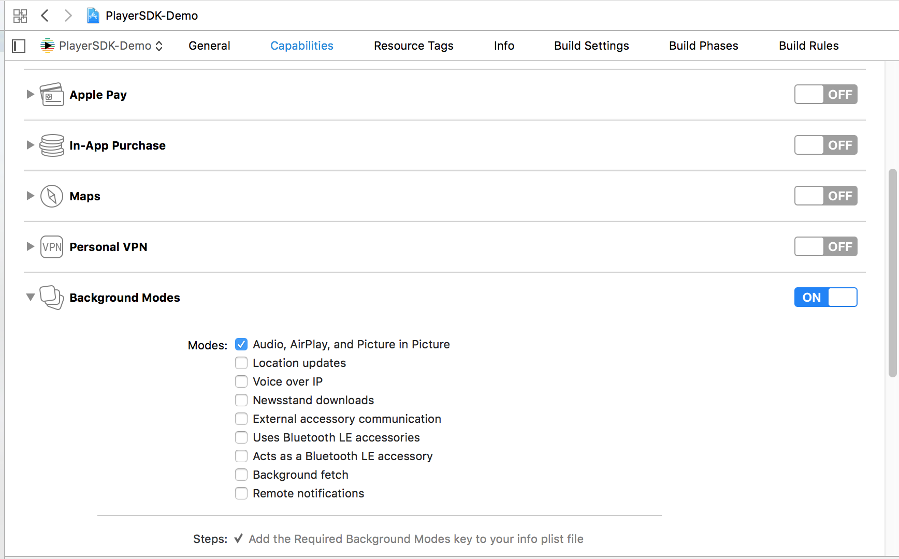

[](https://github.com/kaltura/player-sdk-native-ios) 

This article describes the steps required for adding support for the AirPlay functionality on iOS devices. AirPlay (developed by Apple Inc.) enables wireless streaming of audio, video, photos and more between devices.

## Add the AirPlay Functionality  

1. Enable the Audio, Airplay and Picture in the Picture background mode. 
2. In Xcode 8, select a target, and then under Capabilities > Background Modes, enable "Audio, Airplay and Picture in Picture".
 

3. Import MediaPlayer, and then create an MPVolumeView and add it to your view as follows: 
```
let airPlayBtn = MPVolumeView(frame: CGRect(x: 0, y: 0, width: 44, height: 44))
airPlayBtn.showsVolumeSlider = false
container.addSubview(airPlayBtn)
```
**Optional:** Customize the image of the AirPlay button as follows: 

```
airPlayBtn.setRouteButtonImage(UIImage(named: "name"), for: UIControlState.normal)
```

