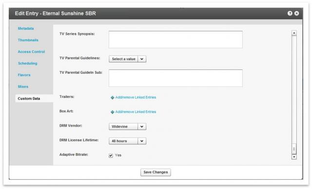

Kaltura's API is a REST-based web service accessed over HTTP. REST APIs provide a simple and easy interface for communication between applications and the Kaltura server. However, this approach can undermine your application's security, if you overlook proper security and authentication when designing your applications.

Kaltura was designed with privacy and security standards in mind, while at the same time providing the openness of Kaltura’s technology as an open source platform and providing flexible integration models for open and free applications as well as highly secured and limited applications.

The following overview describes the authentication and security model of Kaltura’s API, and how to put it to practice when implementing Kaltura's applications.

## Authentication and Security  

To establish communication with the Kaltura servers, the client application must have a secret (one of 2 types) coupled with a unique account ID and a set of permissions.

A valid Kaltura Session (KS) is required to interact with the Kaltura API; displaying content, uploading media, deleting, updating or listing. The KS expiry can be set at session initiation to range from 1 second to 10 years.

Once the KS is acquired, it can be used to interact with content by users for specific pre-set actions, such as uploading, deletion, updating and listing.

Securing application content is done by leveraging one or more of the following methods:

* Data: 
  * The Kaltura Session
  * The channel communication (e.g., HTTPS)
* Video Delivery:
  * Delivery methods and obfuscation (segmentation, url obfuscation, expired urls)
  * DRM
 
## Media Access Control  

There are many possible layers of security that can be deployed within Kaltura’s system. 

Publishers can configure the level of required security for their end users - these security layers work in coordination with the site’s user authentication methods as well. Specifically, publishers can control access to each media asset and restrict user access to assets based on each of the following or a combination of several criteria:

* Authorized domains – Solutions can restrict access to media based on a predefined list of approved domains.
* Geo-location – Solutions can restrict access to media based on the origin on the user. This is set using the user's IP. For example, a publisher in Spain can restrict access to their media to all users outside of Spain, allowing users with Spanish IPs only to access the site's media.
* IP - Limit access to media only from a specific IP Address or range of IP address.
* Time limit - Solutions can allow access to media for a specified time period only, for example, allowing users to access certain media for 7 days only.
* Session limit - "Anonymous" users will be restricted and all access to the data will require a valid KS with specific permissions to the desired entry id. The publisher application is then responsible for determining whether a user has access to the specific content, and if valid, generate and pass a valid KS with the request to the content.

To learn more about the different layers of security, see [The Kaltura Media Access Control Model](http://knowledge.kaltura.com/node/447).

## The Kaltura Session  

Every KS is limited by one or more of the following components:

* Expiry time – Can be set to a short period (1 second) up to 10 years. 

>Note: The player must perform all Kaltura API calls before the user hits play, so setting this too short for player sessions may break the playback experience. About 30 minutes is reasonable for just playback, or you could extend the player to re-negotiate for a session if it expires.

* Number of API calls - E.g., no more than 5 API calls allowed on the KS.

>Note: The number of needed API calls may not be an expected number, especially if you use 3rd party plugins in the player. When using this limitation, make sure all API calling components in your application are known and counted into the number of API calls specified.

* Specific entry playback - When limited by an Access Control Profile, approved entries must be specifically stated by passing the privilege sview:entryId.
* Specific IP address - Limit access to the API from a specific IP or range of IPs by passing privilege **iprestrict:IPADDRESS**.

### KS Components   

The KS is a string composed of the following details:

* Publisher ID – A unique identifier allocated to every Kaltura account. The partner ID can be retrieved from the KMC Integration Settings tab.
* User ID – The identifier of the user within the publisher account performing the API call. This ID is the end-user's ID on the publisher's system.
* KS Type (admin / user) – An admin KS can access all the content of the publisher account and call management APIs, while a user KS can only access content items owned by the specific user.
* Expiry time - Can be set to a short period (1 second) up to 10 years; set in seconds (integer).
* Action limit – The maximum number of API calls allowed using this KS (integer).
* Random number – A time based on random number to make every KS string unique.
* ksdata - Arbitrary data that will be overlooked by Kaltura and can be used to pass additional information on the KS for custom application use.
* Signature – The KS is cryptographically signed (one-way MD5 hashing algorithm), by hashing all of the above with a secret key shared between Kaltura and the publisher.

The information above is then combined with either an Admin or User Secret (depending on the KS type desired), and then compiled using SHA1 algorithm. To generate the KS that is sent through the API: combine the SHA1 hash (in lowercase) and the above parameters in plain-text seperated by semi-colons (i.e. ';'), in Base64.

###  Field Encryption to Protect User Privacy  

Kaltura Session Version 2 (introduced in October 2012) includes field encryption to protect user privacy.

Version 1 (the original format) is maintained for backward compatibility - the Kaltura server accepts both version 1 and 2. The Kaltura server generates version 2 by default for publisher accounts created after Oct 2012. **Implementations that generate a KS locally are encouraged to use KS version 2 as well.**

Because the new KS format requires encryption of the fields, performing a base64 decode on the KS will not reveal its fields (as was the case with KS version 1). 

To decode a KS v2, IT admins and developers who operate self hosted Kaltura servers can use the admin console developer tools page.

###  Generating a KS  

1. Gather all the different KS fields and their values
  *_e – expiry (unix timestamp)
  *_u – user
  *_[t – type](http://www.kaltura.com/api_v3/testmeDoc/index.php?object=KalturaSessionType)
  * Privileges (edit, download, sview, etc.)
2. Compile all fields and URL encode the parameters as a query string, e.g., ```_u=userId&_e=12345678&_t=2&Privileges=sview:1_0xada32as;edit:```
3. Prepend 16 random binary bytes to the fields.
4. Prepend the binary SHA1 hash of the string (20 string).
5. Encrypt the string with the SHA1 hash of the account's API secret using AES128/CBC/Zero bytes padding.
6. Prepend the KS version and partner ID - separated by pipes.
7. Encode the result using Base64.
8. Replace + with – and / with _ to make the KS URL-safe.

To see an implementation of the KS generation algorithm, refer to the **GenerateSession** function below.

## Methods for Generating a Valid KS  

*   **Generate Session Locally** - Combine all the above details, and sign them using the shared secret key. This method is great for reducing callbacks to the server and enhanced security, since the session is generated locally and the secret key is kept private.
*   **Call session.start** - Calling the Kaltura Session.start API to generate a session on the server.  

>Note: Using the session.start API is discouraged unless a secure connection (SSL) is enabled on the account and there are specific reasons to generate the KS on the server side, using short expiry time that requires synchronizing to the server time.

*   **Call user.loginByLoginId - **This method is using Kaltura Users and their Password instead of partner id and secret key. 

>Note: This method is should be preferred in most cases because a) It is easier to remember a user name and password, b) users can be limited to specific roles and permissions (e.g. enabling only upload), and c) users can be deleted, passwords changed or demoted in permissions, while the secret keys can't be modified easily.
*   **Using an Application Token - **This method is described in full in [this article](https://vpaas.kaltura.com/documentation/VPaaS-API-Getting-Started/Generating-KS-with-App-Tokens.html). 

###  KS Types  

**User KS (Non-Authenticated User Session)**

*   A User KS is generated using the USER SECRET.
*   USER type can only use a subset of the available services that are relevant for a user in the system.
*   USER KS can invoke services on his entries and his user-data. (e.g. list actions will result in a filtered list according to the user KS)
*   Attempting to manipulate other users' data will fail.

**Admin KS**

*   ADMIN KS is generated using the ADMIN SECRET.
*   ADMIN Type is an absolute administrator and can call / perform all actions in the system. Services that use this type of session are:
*   Services that expose list of entries / users that belong to different users
*   Services that allow to update other user's data
*   Services that delete data.

*   An admin KS should never reach the browser. By letting users access an admin KS they will be able to cause changes not limited to their own content.
*   An admin KS ignores any privilege restrictions.

**User Roles and Permissions (Authenticated User Session)**

*   Allow more advanced configuration of the access and permissions based on the defined Kaltura User permissions.

#### How May the Session Type Affect API Behavior?  

The session type may affect the way that some API calls behave.

Examples:

* A `media.list` call:
 * With a *user* session – lists videos owned by the user specified in the KS
 * With an *admin* session – lists all entries in the account that match your filter criteria. The list is not filtered for a specific user (unless you specifically filter by *userId*).
* An *update* call: If the user specified in a user session is not the owner of content item, the user does not have permission to update the item. You can override this restriction by specifying special session privileges.


### KS Validation on the Server  

The Kaltura API servers will validate the KS in the following ways:

*   Check the signature against the secret of the specific publisher account to verify the authenticity of the KS.
*   Check whether the KS has elapsed or the action limit has been reached.
*   Check whether the KS was explicitly revoked (by issuing a Kaltura API call to expire a KS).

Once all the KS validations pass, the server will use the KS for:

*   Determining the account on which an API call should be performed.
*   Checking which Kaltura API services / actions the user is authorized to perform, and which API objects / properties he's allowed to view / modify. Based on the Kaltura User permissions.
*   Choosing the content entities visible to the specific user.
*   Setting the owning user for the API actions, e.g. any uploaded content will have the user specified in the KS as its owner.

### KS Privileges  

Session privileges allows applications to limit the user to perform only specific actions. The privileges in the KS, in general, do not block actions but instead limit some actions to a smaller scope.

For example, passing the `sview:{entry ID}` enables the KS to be usable for playing a specific entry. Any attempt to use that specific KS to play another entry ID will fail, as long as the entry is protected with KS-restriction access control.

To verify that the KS passed to the player cannot be used for any update actions, you can either:

* Add a `setrole:PLAYBACK\_BASE\_ROLE` privilege to it, so that it will not be allowed to perform any action other than a white-list of actions needed for the player (such as baseEntry.get, flavorAsset.list etc.).

 or

* Add "widget:1" privilege to the KS to tell the server that this KS was generated for player use only, which will tell the server to make a distinction between a regular USER session and a "PLAYER" session.

You define privileges using a comma-separated list of key-value pairs.

Each key-value pair is a specific privilege:

*   The key is the name of the privilege.
*   The value is the object ID to which the privilege applies.

The key-value pair format is the key followed by the value, separated by a colon: *key:value*

Multiple key-value pairs are separated by commas with no spaces: *key:1\_value,key:0\_value*
Multiple parameters in a single value are separated by a slash: *key:1_value/0_value,key2:another_value*

Some privileges support a wildcard (*) value (for example, *edit:**). A wildcard permits the action for any object.

 
[List of available privileges](https://github.com/kaltura/server/blob/master/alpha/apps/kaltura/lib/request/kSessionBase.class.php#L26)


| Privilege | Description | Use Case | Arguments  |
|----------------------------|--------------------------------------------------------------------------------------------------------------------------------------------------------------------------------------------------------------------------------------------------------------------------------------------------|----------------------------------------------------------------------------------------------------------------------------------------------------------------------------------------------------------------------------------------------------------------|----------------------------------------------------------------------------------------------------------------------------------|
| edit                       | Allows editing (updating) an entry. For example, edit:0_zsadqv3e                                                                                                                                                                                                                                 | Allow a specific user to edit a specific entry that does not belong to the user.                                                                                                                                                                               | Expects entry id or * for wildcard                                                                                               |
| sview                      | Allows viewing and downloading an entry asset                                                                                                                                                                                                                                                    | When implementing pay-per-view with the KS Protected Access Control, allow access to the blocked video asset after purchase.                                                                                                                                   | Expects entry id or * for wildcard                                                                                               |
| list                       | Enables the session to list for entries that are not owned by the user. By default, only admin session can list all entries, this privilege enables it for user sessions.                                                                                                                        | Performing entry search on client side, for example a contribution wizard that allows reuse of entries uploaded by other                                                                                                                                       | Only list:* is supported (list with other parameters will be ingored)                                                            |
| download                   | Allows downloading an entry asset                                                                                                                                                                                                                                                                | Similar to sview. Allow actions that are meant for downloading, as opposed to streaming for playback. For example, raw action (www.kaltura.com/p/1/sp/100/raw/entryId/0_XXXYYYZZ), or download action (www.kaltura.com/p/1/sp/100/download/entryId/0_XXXYYYZZ) | Expects entry id or * for wildcard                                                                                               |
| downloadasset              | enables the download of a specific asset / all assets                                                                                                                                                                                                                                            | Used internally by the server when flavorAsset.getUrl is called.                                                                                                                                                                                               | asset id or *                                                                                                                    |
| editplaylist               | Allows editing an entry in a specific manual playlist                                                                                                                                                                                                                                            | Allow a user to edit a dynamic list of content for a list that is managed in a manual                                                                                                                                                                          | Expects the id of the playlist                                                                                                   |
| sviewplaylist              | Allows viewing an entry in a manual playlist                                                                                                                                                                                                                                                     | Similar to sview. Allow a user to view a dynamic list of                                                                                                                                                                                                       | Expects the id of the playlist                                                                                                   |
| edituser                   | Provides a USER KS the privilege to change the owner of an Entry                                                                                                                                                                                                                                 | Allow a user to change the owner of content to another user. Allow an API-based integration to upload content on behalf of other users.                                                                                                                        | * to allow changing ownership to any user. Or specify a list of allowed usernames. Separate multiple usernames using a slash (/) |
| actionslimit               | Allows a specific session to be used for a defined number of API calls                                                                                                                                                                                                                           | Allow a session with an exposed KS to be used for a restricted period. The purpose is to minimize the risk of a malicious user using the session for prohibited                                                                                                | Expects an integer indicating number of actions                                                                                  |
| setrole                    | Allows a specific session to be used only for a specific role                                                                                                                                                                                                                                    | Temporarily allow a user to perform an action that is not normally permitted, without changing the user                                                                                                                                                        | Expects the id of the role to apply on the ks                                                                                    |
| iprestrict                 | Limits the use of the KS to a certain IP address                                                                                                                                                                                                                                                 | Tighter security for content protection (prevent a user from being able to send the KS to other                                                                                                                                                                | Only a single address is allowed                                                                                                 |
| urirestrict                | Limits the URI of the API call that the KS can call, e.g.,urirestrict:/api_v3/* will be able to call only api v3 URIs                                                                                                                                                                            | Used internally by the server in several API calls that return a URL to the client containing a KS.                                                                                                                                                            | A URI (starting with /), a trailing * indicates it should be treated as a prefix                                                 |
| enableentitlement          |  Forces entitlement checks.Note: there is a setting on account level (configured in the admin console) that determines the default entitlement enforcement                                                                                                                                       | Applications like MediaSpace rely on the server to perform the entitlement checks, so it uses this flag                                                                                                                                                        | Doesn’t have any additional attributes                                                                                           |
| disableentitlement         | Bypasses any entitlement checks, for example, a session with this privilege will be able to access entries in private categories that the user is not a member ofNote: there is a setting on account level (configured in the admin console) that determines the default entitlement enforcement | Admin applications (e.g. KMC) that work on accounts that have entitlement enabled by                                                                                                                                                                           | Doesn’t have any additional attributes                                                                                           |
| disableentitlementforentry | Bypasses entitlement checks for a given entry ID. In other words, access to the given entry will be allowed even if it belongs to a private category that the user is not a member of                                                                                                            |  Sharing an entitlement protected                                                                                                                                                                                                                              | Only a single entry id is allowed (if more are needed multiple privileges of this type can be chained)                           |
| privacycontext             | Sets the privacy context for entitlement checks.                                                                                                                                                                                                                                                 |  See Kaltura’s Entitlement Infrastructure Information Guide.                                                                                                                                                                                                   |                                                                                                                                  |
| enablecategorymoderation   | When set, new category entries that are created on categories that have moderation=true will be created in PENDING status.  Otherwise, they will be created in ACTIVE status.                                                                                                                    | Supports the category moderation flow when entitlement is not enforced.                                                                                                                                                                                        | No additional attributes                                                                                                         |
| reftime                    | A Unix timestamp that is used as the reference of relative date fields. For example, if the API gets a value of 300 for some date field, it will be translated to <reftime> + 300 (5 minutes).When this privilege is not supplied, the server uses the current time.                             | Tests the result of some API call in some timestamp in the future, can be used to validate the effect of scheduled tasks' filters.                                                                                                                             | A Unix timestamp                                                                                                                 |
| preview                    | A limit (in bytes) on the size of the file that is returned from the flavor download action                                                                                                                                                                                                      | Used internally by the server when flavorAsset.getUrl is called on an entry whose access control has preview restrictions.                                                                                                                                     | size in bytes                                                                                                                    |
| sessionid                  | Can be used to group a set of KS's together for invalidation purposes - when session.end is called.With a ks that has sessionid=X, all other KS's that have sessionId=X become invalid as well.                                                                                                  | Applications that create multiple KS's for different uses can use this privilege to terminate all KS's upon user logoff, without the need to keep track of them                                                                                                | An arbitrary string identifying the session                                                                                      |
| apptoken                   | For a KS that was created with appToken.startSession, this privilege will contain the app token through which the KS was created.                                                                                                                                                                | Used mainly for investigation/tracking purposes.                                                                                                                                                                                                               | The apptoken id                                                                                                                  |


     
#### PHP Examples Using the PHPS Kaltura Client Library  

> Important! Never use a KalturaSessionType ADMIN in a KS generated for end users.

**Allow access to a specific entry ID (limitation is set via the Access Control)**  
Example: Allow access to entry id 0_iuasd7 (this [blog post](http://blog.kaltura.org/create-ks-protected-videos-with-free-preview) shows an example of a use case.
 
```
 $ks = $client-&gt;session-&gt;start ( $userSecret, "myUser", KalturaSessionType::USER, $partnerID , null, "sview:0_iuasd7"
```

**Limit the number of actions for a KS**  
Example: Limit the number of actions to four:

```
$ks = $client-&gt;session-&gt;start ( $userSecret, "myUser", KalturaSessionType::USER, $partnerID , null, "actionslimit:4
```

**Set the role on the KS**  
Example: Set the role id 2345 on a KS:

 ```
 $ks = $client-&gt;session-&gt;start ( $userSecret, "myUser", KalturaSessionType::USER, $partnerID , null, "setrole:2345")
 ```

## Secured Delivery  

Kaltura supports various methods of securing delivery of video streams, as follows:

*   Progressive download over HTTPS
*   RTMPE / RTMPTE
*   Akamai HD Network (chunked/throttled HTTPS)
*   SWF Verification
*   IP-linked token authentication

The table below shows the stream security techniques as these apply differently across devices:


|     Delivery              |      Device                          |      Player Security     |      Entitlement      |      Encryption     |
|---------------------------|--------------------------------------|--------------------------|-----------------------|---------------------|
|    Akamai HD              |    Flash - PC, Android               |    SWF verification      |    IP based token     |    HTTPS            |
|    RTMP                   |    Flash - PC, Android               |    SWF verification      |    IP based token     |    RTMPE            |
|    Progressive            |    All – iOS, Bberry, Flash, etc.    |                          |    IP based token     |    HTTPS            |
|    IOS Streaming (HLS)    |    iPhone, iPad                      |                          |    IP based token     |    HTTPS            |

Kaltura’s integrated DRM solutions seamlessly plug in to its existing infrastructure and workflows, protecting customers from vendor lock-in.

### DRM Support  

Encrypted video files are generated as additional “flavors” of original asset using Kaltura’s transcoding farm and based on selected vendor and license policy. 

. 

>Note: Due to licensing requirements, DRM solutions are only available for commercial Kaltura editions (SaaS and On Prem) and are at additional cost. For more information about DRM and the available DRM solutions, please [contact use](http://corp.kaltura.com/company/contact-u) or contact your Kaltura Account Manager. 

### Important Considerations For Application Developers  

When applications are not developed with security in mind, a malicious user can use:

*   A compromised secret to create a KS at will
*   A compromised admin KS to cause irreversible harm to your account (such as deleting all content)

In this section, we highlight a number of common and important practices to consider when creating applications that interact with the Kaltura API.

### Authenticated User Privileges Override the User Type KS  

When you generate a user session KS and specify an ID of a Kaltura Admin User, the KS will allow all the actions included in the user’s role.

### Always Protect your API Secret Keys  

Your API Secret Keys (ADMIN and USER) are generated when you create am account. These keys hold global access permissions to your account and thus should always be kept in secret.

*   Always prefer local session generation over server session.start.
*   Prefer User Login over session.start when local KS generation is not possible.
*   When calling the session.start API request - Make sure the connection between your client and the Kaltura server is encrypted and secured.
*   NEVER keep your secret keys in a front-end application (such as Flash or JavaScript). A KS should always be generated on the server side and then passed to the front-end.
*   Keep the secret keys in a separated file with strict file permissions.

### Use Admin KS with Care  

A compromised Admin KS will allow a malicious user to gain full access to the publisher account, leading way to harm.

Use Admin KS in between servers and with secured communication channel.

### Prefer Login of Users with Defined Roles and Permissions over Generic Admin KS  

Kaltura Users can be assigned a fine-grained level of permissions. This allows applications developers to provide a stronger login and authentication mechanism while not exposing the account secret keys.

Use user.loginByLoginId providing user credentials and your account ID. 

### Use Widget KS for Anonynous Public Content Playback  

The `session.startWidgetSession` provides an anonymous simple and light KS generation mechanism that does not require a secret. This type of session can be used to perform READ operations only and only on content that is defined as publicly available with no Access Control or special permissions.

The Widget KS is perfect for cases where public content needs to be accessed freely and without secured authentication. 

 
