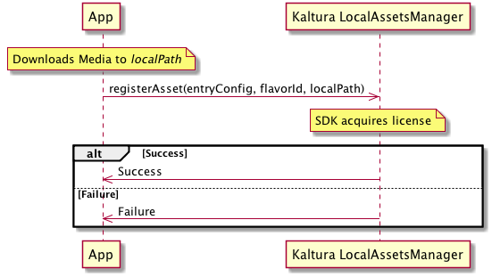

# Offline Playback - Integration Guide

The native mobile SDKs (Android and iOS) allow applications to play downloaded content when the device is offline.

## Objective
After reading this document, a developer integrating with Kaltura Player's Native SDKs will know how to configure offline playback and use downloaded files with the player.

## Scope
The SDK allows the player to play downloaded content. In addition, DRM-protected content has to be registered with the SDK immediately after download, while the device is still online.

The SDK **does not** provide the download function or the download URL. This should be provided by the application.

### Overview
From the application's point-of-view, there are 3 parts to implementing offline playback:

1. Downloading the media files. This includes retrieving the URL of the content and downloading it.
2. Registering DRM-protected files (when the device is still online)
3. Overriding the streaming playback URL with the downloaded file.

## Integration Points

### Android

#### Register

Immediately after the application finishes downloading the media, it calls `LocalAssetsManager.registerAsset()`, providing:

1. `entry`: a configured `KPPlayerConfig` object pointing at the asset, with all required parameters as for regular playback of the asset
2. `flavor`: the flavor id of the downloaded file
3. `localPath`: *absolute* local path to the downloaded file

In addition, a Context object must be provided, as well as a listener implementing AssetEventListener.

The call to `registerAsset()` is asynchronous, and when it's done either `onRegistered()` or `onFailed()` is called on `assetEventListener`.

#### Playback
To override the playback URL with a downloaded file, the application sets the `customSourceURLProvider` property in `PlayerViewController` to an implementation of `SourceURLProvider` that returns non-null URL in its `getURL()` method.

A possible setup is a download manager class that contains a database of downloaded assets. `getURL()` provides the entryId of the asset, which can be used for lookup.

### iOS

#### Register

Immediately after the application finishes downloading the media, it calls `[KPLocalAssetsManager registerAsset:flavor:path:callback:]`, providing:

1. `assetConfig`: a configured `KPPlayerConfig` object pointing at the asset, with all required parameters as for regular play the asset
2. `flavorId`: the flavor id of the downloaded file
3. `localPath`: absolute local path to the downloaded file

In addition a callback block (`kLocalAssetRegistrationBlock`) is required.

The call to `registerAsset:flavor:path:callback:` is asynchronous, and when it's done the callback block is called. In case of an error, the error parameter is set.

#### Playback

To override the playback URL with a downloaded file, the application sets the `customSourceURLProvider` property in `KPViewController` to an implementation of `KPSourceURLProvider` that returns non-null in its `urlForEntryId:currentURL:` method.

A possible setup is a Download Manager class that contains a database of downloaded assets. `urlForEntryId:currentURL:` provides the entryId of the asset, which can be used for lookup.
Common

After the app sets the custom URL provider, it can dynamically change the playback URL according to its own policy. Some examples:

* Download files for the highest available quality, play downloaded files even when online
* Download files for medium quality (to save storage space), but when online play ABR to get better quality.

The Custom URL provider is called at the beginning of every playback.

# Download Location Guidelines

## Android

Files can be downloaded to any directory accessible by the application, including the app's directory in the internal storage, and any directory in the external/shared storage.

It is recommended to store downloaded files in the directory returned by `context.getExternalFilesDir(Environment.DIRECTORY_DOWNLOADS)`. This directory is owned by the application, deleted on uninstall, and typically resides on a relatively large partition. In addition, starting with `KITKAT`, this directory does not need read/write permissions to the shared storage (`WRITE_EXTERNAL_STORAGE`).

## iOS
Per Apple's current recommendation, downloaded video files should be stored in a subdirectory of the app's *Documents* directory – `[NSSearchPathForDirectoriesInDomains(NSDocumentDirectory, NSUserDomainMask, YES) firstObject]`. The selected subdirectory **must** be excluded from backup.

For more information, see Apple's [File System Programming Guide > File System Basics > Where You Should Put Your App’s Files](https://developer.apple.com/library/ios/documentation/FileManagement/Conceptual/FileSystemProgrammingGuide/FileSystemOverview/FileSystemOverview.html#//apple_ref/doc/uid/TP40010672-CH2-SW28).

# Sequence Diagrams

## Register Downloaded Asset

## Playback Downloaded Asset

