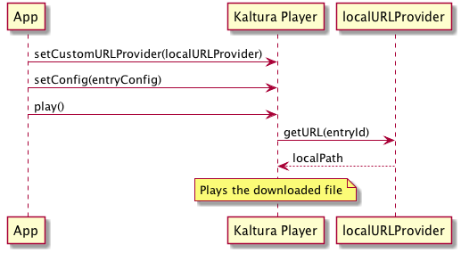

# Offline Playback - Integration Guide

The native mobile SDKs (Android and iOS) allow applications to play downloaded content when the device is offline.

## Objective
After reading this document, a developer integrating with Kaltura Player's Native SDKs will know how to configure offline playback and to use downloaded files with the Player.

## Scope
The SDK allows the player to play downloaded content. In addition, DRM-protected content has to be registered with the SDK immediately after download, while the device is still online.

The SDK **does not** provide the download function or the download URL. This should be provided by the application.

### Overview
From the application's point-of-view, there are three parts to implementing offline playback:

1. Downloading the media files - This includes retrieving the URL of the content and downloading it.
2. Registering DRM-protected files (when the device is still online).
3. Overriding the streaming playback URL with the downloaded file.

## Integration Points
&nbsp;
### Android
&nbsp;
#### Register
Immediately after the application finishes downloading the media, it calls `LocalAssetsManager.registerAsset()`, providing:

1. `entry`: A configured `KPPlayerConfig` object that points at the asset, with all  parameters required for regular playback of the asset
2. `flavor`: The flavor id of the downloaded file
3. `localPath`: The *absolute* local path to the downloaded file

In addition, a Context object must be provided, as well as a listener implementing AssetEventListener.

The call to `registerAsset()` is asynchronous; when done, one of the following will be called on `assetEventListener: `onRegistered()` or `onFailed()`.
#### Playback
To override the playback URL with a downloaded file, the application sets the `customSourceURLProvider` property in `PlayerViewController` to an implementation of `SourceURLProvider` that returns a non-null URL in its `getURL()` method.

A possible setup is a download manager class that contains a database of downloaded assets. `getURL()` provides the entryId of the asset, which can be used for lookup.

### iOS
&nbsp;

#### Register

Immediately after the application finishes downloading the media, it calls `[KPLocalAssetsManager registerAsset:flavor:path:callback:]`, providing:

1. `assetConfig`: A configured `KPPlayerConfig` object that points at the asset, with all the parameters required for regular play of the asset
2. `flavorId`: The flavor ID of the downloaded file
3. `localPath`: The absolute local path to the downloaded file

In addition, a callback block (`kLocalAssetRegistrationBlock`) is required.

The call to `registerAsset:flavor:path:callback:` is asynchronous, and when done, the callback block is called. In case of an error, the error parameter is set.

#### Playback

To override the playback URL with a downloaded file, the application sets the `customSourceURLProvider` property in `KPViewController` to an implementation of `KPSourceURLProvider`, which returns a non-null result in its `urlForEntryId:currentURL:` method.

A possible setup is a Download Manager class that contains a database of downloaded assets. `urlForEntryId:currentURL:` provides the entryId of the asset, which can be used for lookup.
Common

After the application sets the custom URL provider, it can change the playback URL dynamically according to its own policy. For example:

* Download files for the highest available quality, play downloaded files even when online
* Download files for medium quality (to save storage space), but when online, play ABR to get better quality.

The Custom URL provider is called at the beginning of every playback.

# Download Location Guidelines
&nbsp;

## Android

Files can be downloaded to any directory accessible by the application, including the application's directory in the internal storage, and any directory in the external/shared storage.

It is recommended to store downloaded files in the directory returned by `context.getExternalFilesDir(Environment.DIRECTORY_DOWNLOADS)`. This directory is owned by the application, deleted on uninstall, and typically resides on a relatively large partition. In addition, starting with `KITKAT`, this directory does not need read/write permissions to the shared storage (`WRITE_EXTERNAL_STORAGE`).

## iOS
Per Apple's current recommendation, downloaded video files should be stored in a subdirectory of the application's *Documents* directory – `[NSSearchPathForDirectoriesInDomains(NSDocumentDirectory, NSUserDomainMask, YES) firstObject]`. The selected subdirectory **must** be excluded from backup.

For more information, see Apple's [File System Programming Guide > File System Basics > Where You Should Put Your App’s Files](https://developer.apple.com/library/ios/documentation/FileManagement/Conceptual/FileSystemProgrammingGuide/FileSystemOverview/FileSystemOverview.html#//apple_ref/doc/uid/TP40010672-CH2-SW28).

# Sequence Diagrams
&nbsp;

## Register Downloaded Asset


participant App
participant "Kaltura LocalAssetsManager" as LAM

note over App: Downloads Media to //localPath//

App->>LAM: registerAsset(entryConfig, flavorId, localPath)
note over LAM: SDK acquires license
alt Success
LAM->>App: Success
else Failure
LAM->>App: Failure
end



## Playback Downloaded Asset

